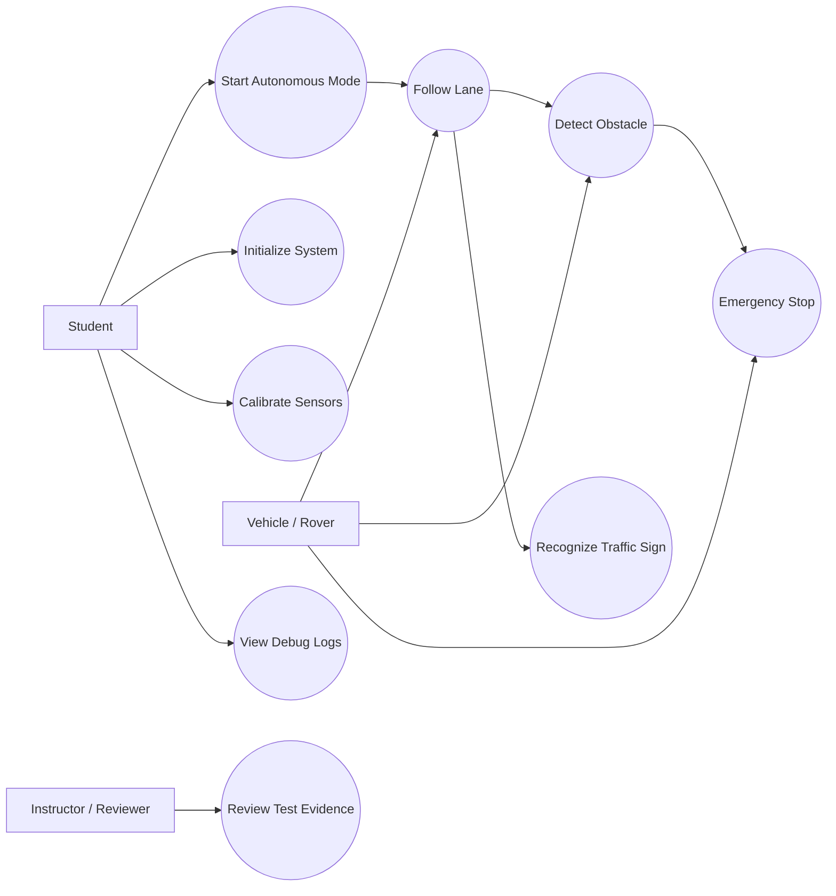
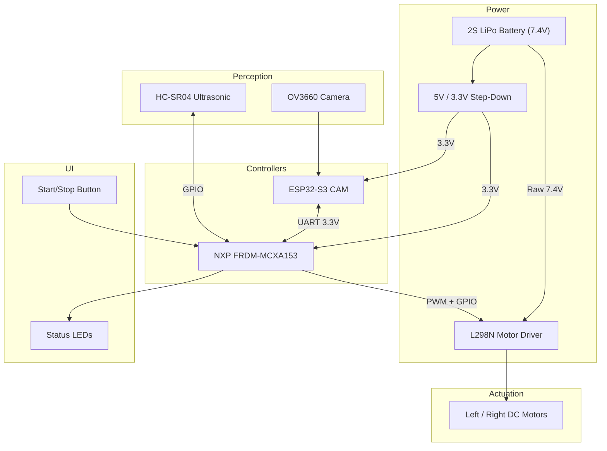

# Autonomous Car

> Documentation draft generated from Agent 0 and Agent 1 outputs.
> AI assists. Humans decide.

## 1. Introduction

This project builds a self-driving rover that pairs an **ESP32-S3 CAM** (vision and AI) with the **NXP FRDM-MCXA153** (bare-metal motor control and obstacle avoidance). The rover follows a lane using computer vision, recognizes traffic signs via TinyML, and avoids obstacles reactively using ultrasonic sensors.

The purpose is to demonstrate a distributed embedded processing architecture for edge AI robotics. It is useful for students because it covers PWM motor control, UART inter-MCU communication, PID control loops, and optionally TinyML inference — all within a tangible, demonstrable physical system.

The **NXP FRDM-MCXA153** is the mandatory target board for all summer school projects. It serves as the real-time execution layer that translates high-level steering commands into safe physical movement.

> This documentation is a draft and must be validated by students and instructors before implementation.

## 2. General Description

### 2.1 Project Summary

- **Project Name:** Autonomous Car
- **Short Summary:** A self-driving rover pairing an ESP32-S3 CAM for vision/AI with the NXP FRDM-MCXA153 for motor control and obstacle avoidance.
- **Main Objective:** Navigate autonomously in a controlled environment by keeping within a lane and recognizing traffic signs, while avoiding obstacles.
- **Intended Users:** Third-year Computer Science students.
- **Operating Environment:** Controlled indoor environment with clear track markings and traffic signs.
- **Selected Scope:** Recommended (core motor/obstacle logic on NXP + UART vision commands from ESP32).
- **Main Behavior:** ESP32-S3 processes camera feeds for lane keeping, sends steering/speed commands via UART to the NXP FRDM-MCXA153. The NXP drives motors and stops autonomously if distance sensors detect an obstacle.
- **Inputs:** Camera images (via ESP32); Distance measurements from ultrasonic sensors.
- **Outputs:** PWM signals for motor speed; Direction signals for L298N H-Bridge.
- **Out of Scope:** GPS navigation; SLAM; Public road driving.

### 2.2 Feature Tiers

| Tier | Description | Main Features | Extra Components | Main Risks | Suitability |
|---|---|---|---|---|---|
| Core | Basic rover using NXP FRDM-MCXA153 only | IR line following; Ultrasonic obstacle avoidance; DC motor control via PWM and L298N | L298N; DC Motors; HC-SR04 | 5V logic mismatch; brownouts | Suitable (Beginner) |
| Recommended | Adds ESP32-S3 CAM for computer vision lane tracking | Camera-based lane tracking; UART protocol between MCUs; Reactive obstacle avoidance | ESP32-S3 CAM | UART corruption | Suitable (Intermediate) |
| Advanced | Adds TinyML traffic sign recognition on ESP32 | Edge AI / TinyML inference; Dual-core ESP32 processing; Priority command overrides on NXP | None extra | Task starvation; TinyML training time | Risky but Optional |

### 2.3 Scenarios

| ID | Scenario | Description |
|---|---|---|
| SC-001 | Startup | NXP initializes PWM drivers for L298N and establishes UART listening port. ESP32 boots and calibrates camera. |
| SC-002 | Normal Operation | ESP32 tracks lane and sends continuous UART commands (speed, turn rate). NXP translates to left/right PWM for differential drive. |
| SC-003 | Obstacle Avoidance | Object detected by ultrasonic sensor. NXP halts L298N (PWM=0), ignoring ESP32 commands until path clears. |
| SC-004 | Traffic Sign Override | (Advanced) ESP32 detects STOP sign via TinyML. Sends override command. NXP halts for configured duration. |
| SC-005 | Communication Loss | NXP detects UART timeout. System defaults to full stop (PWM=0). |
| SC-006 | Debugging | Student connects USB serial console to NXP. Reads sensor values, motor duties, and UART packets in real time. |

### 2.4 User Stories

| ID | User Story |
|---|---|
| US-001 | As a student, I need the NXP FRDM-MCXA153 to handle bare-metal motor control so that the system reacts instantly to obstacles without waiting on the ESP32 vision loop. |
| US-002 | As a developer, I need to send differential drive commands over UART so that the computer vision logic on the ESP32 can steer the chassis. |
| US-003 | As an instructor, I need to review test evidence (videos, serial logs) so that I can verify the rover meets acceptance criteria. |
| US-004 | As a student, I need a physical start/stop button so that I can safely enable or disable the rover during testing. |

### 2.5 Use Case Diagram



### 2.6 Hardware and Software Block Diagram



**Power Flow:** 2S LiPo (7.4V) feeds the L298N motor power input directly and is stepped down to 3.3V/5V for the MCUs and sensors.

**Data/Control Flow:** Camera → ESP32 (vision processing) → UART → NXP (motor mixing) → L298N → Motors. Ultrasonic sensor polled directly by NXP for reactive obstacle avoidance.

**Compatibility Concerns:** HC-SR04 Echo pin may output 5V — requires a voltage divider or 3.3V-compatible variant. L298N logic inputs accept 3.3V.

**Protection Needs:** Decoupling capacitors near MCU power pins. Common ground between all boards. Motor power rail isolated from logic rail.

**Datasheet Checks Required:** FRDM-MCXA153 pinout for available PWM/UART/GPIO; L298N input voltage thresholds; HC-SR04 voltage levels.

## 3. Hardware Design

### 3.1 Bill of Materials

| # | Component | Qty | Tier | Purpose | Likely Interface | Voltage / Power Notes | Risks / Checks |
|---|---:|---:|---|---|---|---|---|
| 1 | NXP FRDM-MCXA153 | 1 | Core | Main execution controller | MCU | 3.3V logic | Mandatory board |
| 2 | L298N Motor Driver | 1 | Core | Drive DC motors (differential) | PWM + GPIO | Separate motor power rail; shared GND | Motor noise; current draw |
| 3 | DC Motors | 2 | Core | Propulsion (left/right) | Via L298N | High current | Inductive spikes |
| 4 | HC-SR04 Ultrasonic Sensor | 1 | Core | Obstacle detection | GPIO (Trigger/Echo) | Typically 5V — check variant | Level shift Echo pin if 5V |
| 5 | IR Line Tracking Sensors | 2-3 | Core | Lane detection (core version) | GPIO or ADC | Usually 3.3V compatible | Verify logic levels |
| 6 | Start/Stop Button | 1 | Core | Safety kill switch | GPIO with interrupt | 3.3V | Debouncing required |
| 7 | Status LEDs | 2-3 | Core | Mode indication | GPIO | 3.3V; use onboard LEDs | Current limiting resistor |
| 8 | ESP32-S3 CAM (OV3660) | 1 | Recommended | Vision and Edge AI | UART to NXP | 3.3V logic; power hungry | Separate toolchain |
| 9 | 2S LiPo Battery | 1 | Core | Main power source | Power connectors | 7.4V nominal | Over-discharge protection |
| 10 | Step-Down Regulator | 1 | Core | Logic power supply | VCC/GND | 7.4V → 5V/3.3V | Check max output current |
| 11 | Voltage Divider / Level Shifter | TBD | Core | Protect NXP from 5V Echo | Passive/Active | 5V → 3.3V | Only if HC-SR04 is 5V |
| 12 | Decoupling Capacitors | TBD | Core | Power stability | Passive | Near MCU VCC/GND | Check values per datasheet |

### 3.2 Hardware Block Diagram Description

The **NXP FRDM-MCXA153** is the central execution controller. It receives regulated 3.3V power from a step-down converter fed by a 2S LiPo battery. The battery also directly supplies raw voltage to the **L298N Motor Driver**. The NXP drives the L298N using 2 PWM signals (ENA, ENB) for speed and 4 GPIO signals (IN1-IN4) for direction. An **HC-SR04 ultrasonic sensor** connects via GPIO for trigger and echo. A **Start/Stop button** provides a hardware kill switch via GPIO interrupt. **Onboard LEDs** indicate operating mode.

For the recommended tier, the **ESP32-S3 CAM** connects via 3.3V UART (TX/RX cross-connected, shared ground). The ESP32 handles all vision processing and sends parsed steering/speed commands to the NXP.

**Voltage Compatibility:** Both ESP32 and NXP operate at 3.3V logic — no level shifting needed for UART. The HC-SR04 Echo may be 5V and requires a voltage divider. The L298N logic inputs accept 3.3V signals.

**Datasheet Checks:** Verify FRDM-MCXA153 available PWM channels, UART peripheral instances, and GPIO current limits. Verify L298N minimum logic HIGH threshold. Verify HC-SR04 variant voltage.

### 3.3 Pin Allocation Draft

| Component | Tier | Signal | Required MCU Capability | Suggested Pin / Capability | Voltage Level | Direction | Interface | Verification Needed |
|---|---|---|---|---|---|---|---|---|
| L298N ENA | Core | Motor A Speed | PWM-capable pin | Generic PWM | 3.3V | Output | PWM | Board pinout check |
| L298N ENB | Core | Motor B Speed | PWM-capable pin | Generic PWM | 3.3V | Output | PWM | Board pinout check |
| L298N IN1 | Core | Motor A Dir 1 | GPIO-capable pin | Generic GPIO | 3.3V | Output | GPIO | Board pinout check |
| L298N IN2 | Core | Motor A Dir 2 | GPIO-capable pin | Generic GPIO | 3.3V | Output | GPIO | Board pinout check |
| L298N IN3 | Core | Motor B Dir 1 | GPIO-capable pin | Generic GPIO | 3.3V | Output | GPIO | Board pinout check |
| L298N IN4 | Core | Motor B Dir 2 | GPIO-capable pin | Generic GPIO | 3.3V | Output | GPIO | Board pinout check |
| HC-SR04 Trigger | Core | Ping start | GPIO-capable pin | Generic GPIO | 3.3V | Output | GPIO | Board pinout check |
| HC-SR04 Echo | Core | Distance pulse | GPIO / Timer Capture | Generic GPIO/Timer | 3.3V In (level shift if 5V) | Input | GPIO/Timer | Check sensor voltage |
| Button | Core | Start/Stop | GPIO-capable pin (IRQ) | Generic GPIO with interrupt | 3.3V | Input | GPIO | Debounce needed |
| LED (status) | Core | Mode indicator | GPIO-capable pin | Onboard LED or generic GPIO | 3.3V | Output | GPIO | Current limit |
| ESP32 UART TX | Recommended | Vision commands | UART-capable RX pin | Generic UART RX | 3.3V | Input | UART | Verify UART instance |
| ESP32 UART RX | Recommended | Acknowledgments | UART-capable TX pin | Generic UART TX | 3.3V | Output | UART | Verify UART instance |

Generic FRDM-MCXA153 capability only — exact pin requires board pinout and datasheet verification.

### 3.4 Electrical Schematics

- `TODO: Add final schematic image or link.`
- `TODO: Add L298N motor driver wiring diagram.`
- `TODO: Add HC-SR04 sensor connection diagram (including voltage divider if 5V).`
- `TODO: Add power distribution diagram (LiPo → regulator → logic; LiPo → L298N).`
- `TODO: Add ESP32-to-NXP UART wiring diagram.`

### 3.5 Signal Diagrams and Measurements

- `TODO: PWM signal capture (oscilloscope) — verify frequency and duty cycle on L298N ENA/ENB.`
- `TODO: Ultrasonic echo signal capture — verify pulse width vs. distance.`
- `TODO: UART serial debug capture — verify packet format between ESP32 and NXP.`
- `TODO: Power rail measurement — verify 3.3V and motor rail stability under load.`
- `TODO: Current measurement — measure motor stall current and idle current.`
- `TODO: Timing analysis — measure obstacle detection loop period.`

## 4. Software Design

### 4.1 Development Environment

- **NXP FRDM-MCXA153:** MCUXpresso IDE or VS Code with NXP extension.
- **ESP32-S3:** ESP-IDF or Arduino IDE.
- **SDK:** MCUXpresso SDK (bare-metal drivers for UART, PWM, ADC, GPIO); ESP32 Camera Driver; TensorFlow Lite for Microcontrollers (Advanced).
- **Language:** C.
- **Debugging:** On-board MCU-Link debugger; Serial console via USB.
- **Starting Point:** Hello World and PWM driver examples from MCUXpresso SDK.

`TODO: Confirm exact SDK version, build system, and flashing/debugging workflow.`

### 4.2 Firmware Architecture

- **Architecture Style:** Bare-metal superloop with interrupt-driven UART.
- **Reason:** Minimizes complexity while ensuring UART commands are buffered without blocking the critical obstacle-detection loop.

**Main Modules:**

| Module | Responsibility |
|---|---|
| Motor Driver | Configure PWM channels; set left/right motor speed and direction via L298N |
| Ultrasonic Sensor | Trigger ping; measure echo pulse width; calculate distance |
| UART Command Parser | Receive ESP32 packets via ISR; parse speed/steering targets |
| Motor Mixer | Translate steering vector into differential left/right PWM values |
| Safety Manager | Enforce obstacle halt; enforce UART timeout halt; manage start/stop button |
| Debug/Logging | Print sensor values, motor duties, and system state to USB serial console |

**Startup Sequence:** Initialize system clocks → Configure GPIO (LEDs, button, L298N direction, ultrasonic trigger) → Configure PWM (L298N ENA/ENB) → Configure UART (ESP32 link) → Enable interrupts → Enter main loop.

**Main Loop Flow:** Trigger ultrasonic → Measure echo → Calculate distance → If distance < threshold: set obstacle flag, PWM=0 → Else: clear obstacle flag, apply motor mixer output → Repeat.

**Interrupt Handling:** UART RX ISR buffers incoming bytes. On complete packet, updates global target speed/steering variables. Watchdog or software timer detects UART timeout.

**Error Handling / Safe-State:** Loss of UART communication (timeout) → PWM=0. Obstacle detected → PWM=0. Button press → toggle enable/disable. Default power-on state is stopped.

**Configuration Constants:** `OBSTACLE_THRESHOLD_CM` (AI assumption: 15); `UART_BAUD_RATE` (TBD); `UART_TIMEOUT_MS` (TBD); `PWM_FREQUENCY_HZ` (TBD); `MAX_SPEED_DUTY` (TBD).

### 4.3 Main Algorithms and Data Structures

- **State Machine:** States: `INIT` → `IDLE` → `DRIVE` → `OBSTACLE_HALT` → `SIGN_HALT` (advanced). Transitions driven by sensor readings and UART commands.
- **Motor Mixer (Differential Drive):** Converts a (speed, steering) vector into independent left/right PWM duties: `left = speed + steering`, `right = speed - steering`, clamped to valid range.
- **Ultrasonic Distance Calculation:** `distance_cm = echo_pulse_us / 58` (AI assumption — verify with sensor datasheet).
- **UART Packet Parsing:** Simple framed protocol with start byte, payload (speed, steering), checksum, end byte. Circular buffer in ISR.
- **PID Lane Keeping (ESP32 side):** Grayscale → ROI mask → Binarize → Find lane centroids → Calculate error from center → PID output → Send via UART.
- **TinyML Inference (Advanced, ESP32 side):** Resize frame → Run TFLite model → If confidence > threshold → Send override command.

### 4.4 Functional Requirements Summary

| ID | Tier | Requirement | Priority | Verification | Acceptance Criterion |
|---|---|---|---|---|---|
| FR-001 | Core | The system shall use the NXP FRDM-MCXA153 as the main controller platform. | Must | Inspection | NXP board is present and controls L298N |
| FR-002 | Core | The system shall control two DC motors via L298N using differential steering (2 PWM, 4 GPIO). | Must | Demonstration | Motors spin correctly for forward, left, right |
| FR-003 | Core | When ultrasonic detects obstacle closer than 15 cm (AI assumption), the system shall set PWM to 0. | Must | Test | Motors stop when object placed at 10 cm |
| FR-004 | Core | The system shall provide a start/stop button to safely enable or disable the rover. | Must | Demonstration | Button toggles motor enable/disable |
| FR-005 | Recommended | The system shall receive steering and speed targets via UART from the ESP32. | Must | Test | UART command alters motor speeds |
| FR-006 | Recommended | If no valid UART packet is received within timeout (TBD), the system shall halt motors. | Must | Test | Disconnecting ESP32 causes rover to stop |
| FR-007 | Advanced | When a STOP override command is received via UART, the system shall halt motors for a configured duration. | Should | Test | ESP32 STOP command overrides normal drive |

### 4.5 Non-Functional Requirements Summary

| ID | Tier | Category | Requirement | Metric / Threshold | Verification |
|---|---|---|---|---|---|
| NFR-001 | Core | Safety / HW | All components shall be electrically compatible with 3.3V logic or use interface circuitry. | Max 3.3V on GPIO | Voltage measurement |
| NFR-002 | Core | Timing | Obstacle detection loop shall execute in under 50 ms (AI assumption). | < 50 ms cycle | Logic analyzer |
| NFR-003 | Core | Power | L298N motor power rail shall be isolated from logic rail (shared ground only). | 0 logic brownouts | Oscilloscope |
| NFR-004 | Core | Safety | System shall default to stopped state on power-on and on communication loss. | PWM=0 on boot/timeout | Demonstration |
| NFR-005 | Core | Reliability | UART protocol shall include error detection (checksum or framing). | No undetected corrupt packets | Test |
| NFR-006 | Core | Privacy | All processing shall be local; no cloud streaming of camera feeds. | No network traffic | Inspection |
| NFR-007 | Core | Memory | NXP firmware shall fit within MCU Flash and SRAM limits. | Within datasheet limits | Build output check |
| NFR-008 | Core | Usability | Serial debug console shall print human-readable sensor and motor state. | Readable output | Demonstration |

### 4.6 Test Plan Summary

| Test ID | Requirement | Tier | Test Type | Expected Result | Evidence |
|---|---|---|---|---|---|
| TC-001 | FR-001 | Core | Inspection | NXP FRDM-MCXA153 is the primary board controlling L298N | Photo |
| TC-002 | FR-002 | Core | Demonstration | Motors spin forward, reverse, left, right correctly | Video |
| TC-003 | FR-003 | Core | Test | Motors stop immediately when object at 10 cm | Video |
| TC-004 | FR-004 | Core | Demonstration | Button press toggles rover on/off | Video |
| TC-005 | FR-005 | Recommended | Test | UART command from ESP32 changes motor speeds | Serial log; oscilloscope |
| TC-006 | FR-006 | Recommended | Test | Disconnecting ESP32 causes rover to halt within timeout | Video |
| TC-007 | FR-007 | Advanced | Test | STOP override halts motors for configured duration | Video; serial log |
| TC-008 | NFR-002 | Core | Analysis | Obstacle loop period measured < 50 ms | Logic analyzer capture |

### 4.7 Traceability Summary

| User Story | Requirement(s) | Test Case(s) | Evidence | Gap |
|---|---|---|---|---|
| US-001 | FR-001, FR-003 | TC-001, TC-003 | Photo, Video | None |
| US-002 | FR-002, FR-005 | TC-002, TC-005 | Video, Serial log | None |
| US-003 | All FRs | TC-001 to TC-008 | All evidence types | None |
| US-004 | FR-004 | TC-004 | Video | None |

## 5. Risk Matrix

| ID | Category | Tier | Severity | Probability | Impact | Mitigation | Human Approval |
|---|---|---|---|---|---|---|---|
| R-001 | Voltage | Core | High | High | 5V Echo destroying 3.3V NXP GPIO | Use voltage divider or 3.3V HC-SR04+ | Yes |
| R-002 | Power | Core | High | Medium | Motor stall current browning out MCUs | Separate power rails; decoupling caps; adequate battery | Yes |
| R-003 | Safety | Core | Medium | Medium | Rover runs off table or hits objects | Physical kill switch; speed limits; test on blocks first | No |
| R-004 | Technical | Recommended | Medium | Medium | UART message corruption causing erratic movement | Checksum/framing in protocol; halt on invalid packet | No |
| R-005 | Timing | Core | Medium | Low | Blocking ultrasonic read starving main loop | Use timer capture for echo; avoid busy-wait | No |
| R-006 | Technical | Recommended | Medium | Medium | Camera lighting/framing causing poor lane extraction | Controlled lighting; tunable thresholds | No |
| R-007 | Timing | Advanced | Medium | Medium | TinyML on Core 1 starving Core 0 lane keeping | Task prioritization; frame rate limiting on Core 1 | No |
| R-008 | Advanced | Advanced | Low | High | TinyML model training takes too long | Use pre-trained model; limit to 2 classes | Yes |
| R-009 | Memory | Advanced | Medium | Medium | ESP32 SRAM exhaustion if PSRAM misconfigured | Verify PSRAM init in ESP-IDF config | No |
| R-010 | Safety | Core | High | Low | No datasheet review leads to overcurrent on GPIO | Students must review FRDM-MCXA153 pinout before wiring | Yes |

## 6. Assumptions and Open Questions

### 6.1 Confirmed Facts

- ESP32-S3 CAM board handles vision and AI tasks.
- NXP FRDM-MCXA153 handles motor PWM and steering.
- Ultrasonic/IR sensors connect directly to NXP board.
- ESP32 sends UART commands to NXP.
- Core 0 of ESP32 does PID lane keeping at 20-30 FPS.
- Core 1 of ESP32 does TinyML sign recognition at 3-5 FPS.
- The rover uses **differential steering** (user confirmed).
- The motor driver is the **L298N** (user confirmed).

### 6.2 AI Assumptions

- **A-001 (Agent 0):** Level shifting is not required for ESP32-to-NXP UART (both 3.3V logic).
- **A-002 (Agent 1):** The L298N requires 2 PWM signals (ENA, ENB) and 4 GPIO direction signals (IN1-IN4).
- **A-003 (Agent 1):** Ultrasonic emergency halt threshold is 15 cm.
- **A-004 (Agent 1):** Obstacle detection loop must complete in under 50 ms.
- **A-005 (Agent 2):** Ultrasonic distance formula: `distance_cm = echo_pulse_us / 58`.

### 6.3 Open Questions

| ID | Question | Why It Matters | Owner | Status |
|---|---|---|---|---|
| Q-001 | Will a 3.3V ultrasonic sensor (HC-SR04+) be provided, or standard 5V? | Determines if voltage divider is needed on Echo pin | Instructor | Open |
| Q-002 | What battery chemistry and capacity will be used? | Affects safety, runtime, and power budget | Instructor | Open |
| Q-003 | What UART baud rate and packet format will be used? | Must be agreed between ESP32 and NXP firmware teams | Student | Open |
| Q-004 | What PWM frequency is optimal for L298N with the chosen DC motors? | Affects motor efficiency and audible noise | Student | Open |
| Q-005 | Will IR line-tracking sensors be used for the core version? | Determines additional pin allocation and BOM items | Student / Instructor | Open |

## 7. Human Review Checklist

- [ ] Scope approved (Recommended level)
- [ ] Selected feature tier approved
- [ ] FRDM-MCXA153 confirmed as mandatory board
- [ ] FRDM-MCXA153 pinout checked against pin allocation draft
- [ ] Voltage compatibility checked (HC-SR04 Echo, L298N logic inputs)
- [ ] Current limits checked (GPIO drive strength for L298N inputs)
- [ ] Power budget checked (Battery → Regulator → MCUs; Battery → L298N → Motors)
- [ ] External modules checked (L298N, HC-SR04, ESP32-S3 CAM)
- [ ] Advanced components approved or removed (TinyML on ESP32)
- [ ] Sensor/actuator interfaces confirmed
- [ ] Firmware architecture approved (bare-metal superloop + UART ISR)
- [ ] Timing and memory constraints reviewed
- [ ] Test plan reviewed
- [ ] Traceability reviewed
- [ ] Safety/privacy/security risks reviewed
- [ ] AI assumptions accepted or rejected
- [ ] Implementation allowed to start

## 8. Obtained Results

```
TODO: Complete after implementation.

Describe:
- what was implemented;
- what works;
- what does not work yet;
- measurements and test results;
- photos or screenshots;
- demo observations;
- limitations.
```

## 9. Conclusions

```
TODO: Complete at the end of the project.

Discuss:
- what was learned;
- what worked well;
- what was difficult;
- what would be improved in a future version;
- how Gen AI helped or failed to help.
```

## 10. Download

```
TODO: Add links or attach:
- source code archive;
- schematic files;
- build instructions;
- README;
- ChangeLog;
- test logs;
- demo video;
- final presentation.
```

## 11. Project Journal

| Date | Work Completed | Problems / Risks | Next Steps | Author |
|---|---|---|---|---|
| TODO | TODO | TODO | TODO | TODO |
| TODO | TODO | TODO | TODO | TODO |
| TODO | TODO | TODO | TODO | TODO |
| TODO | TODO | TODO | TODO | TODO |

## 12. Bibliography / Resources

### Hardware Resources

- TODO: FRDM-MCXA153 board documentation and user guide.
- TODO: MCXA153 datasheet / reference manual.
- TODO: L298N motor driver datasheet.
- TODO: HC-SR04 ultrasonic sensor datasheet.
- TODO: ESP32-S3 CAM module documentation.
- TODO: 2S LiPo battery specifications and safety guide.

### Software Resources

- TODO: NXP MCUXpresso SDK documentation.
- TODO: ESP-IDF documentation (for ESP32-S3).
- TODO: TensorFlow Lite for Microcontrollers documentation (if used).
- TODO: Project repository link.

### Learning Resources

- TODO: Course/lab notes.
- TODO: Tutorials or papers used.
- TODO: PID control theory references.

## 13. Documentation Status

**READY FOR HUMAN REVIEW**

- The complete hardware topology is mapped with L298N differential drive (user confirmed) and all three feature tiers clearly separated.
- The distributed architecture (ESP32 vision + NXP execution) is well-defined with clear UART boundaries.
- All Must-priority functional requirements have linked test cases and traceability to user stories.
- Hardware risks (5V logic mismatch, motor brownouts, safety kill switch) are identified with mitigations.
- Open questions regarding sensor voltage, battery choice, and UART protocol parameters are flagged for human resolution before implementation begins.
