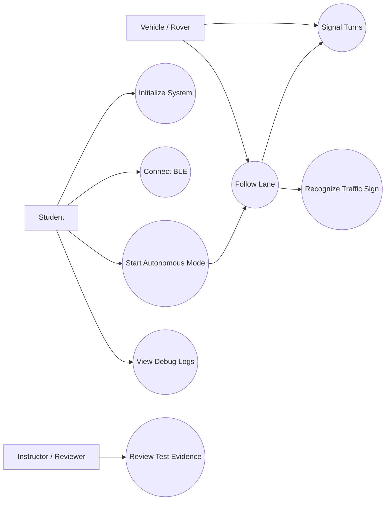
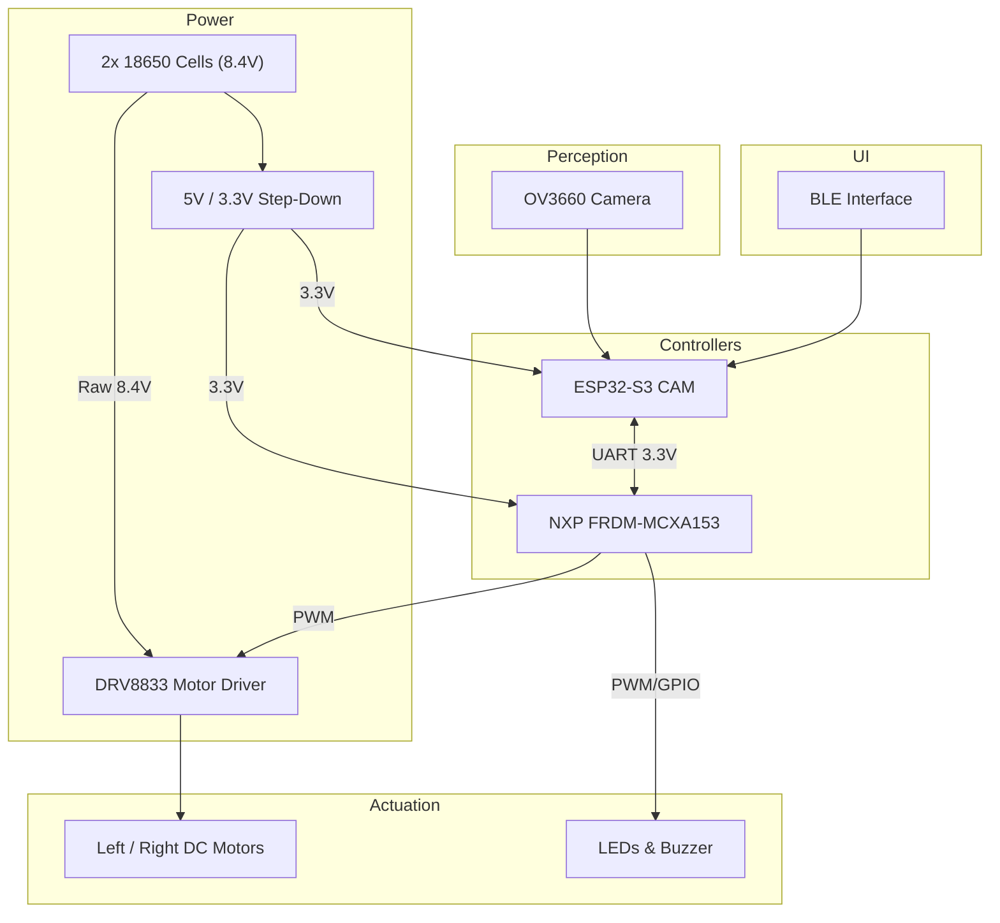
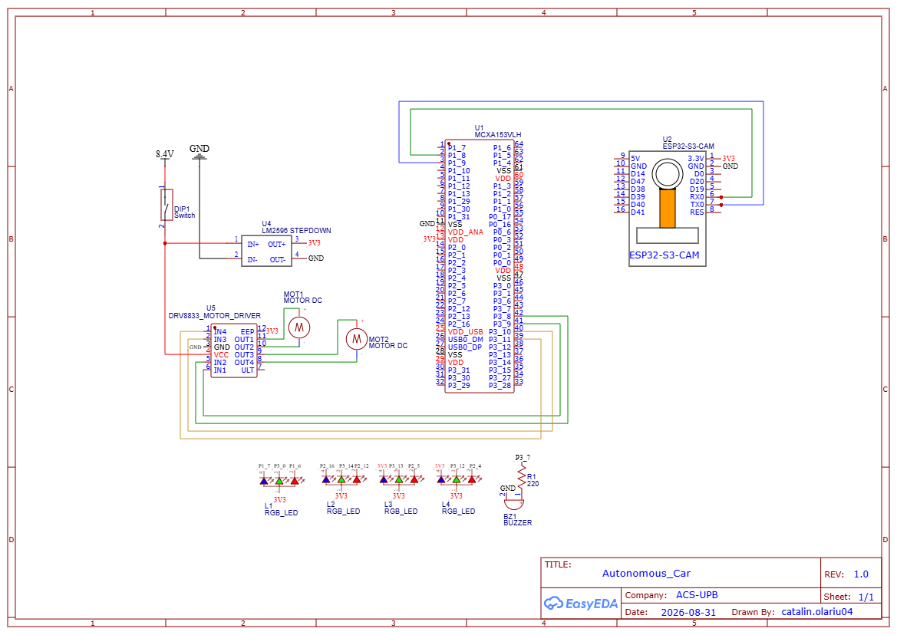
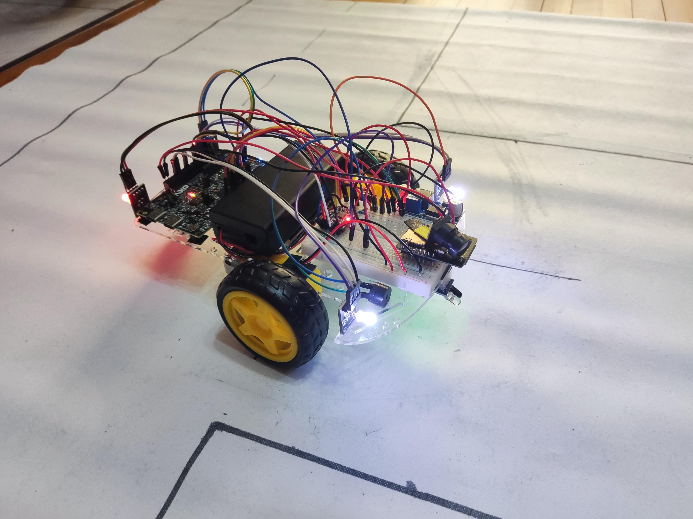

# Autonomous Car

## 1. Introduction

This project builds a self-driving rover that pairs an **ESP32-S3 CAM** (vision and AI) with the **NXP FRDM-MCXA153** (bare-metal motor control and signaling). The rover strictly follows the lines of the road using computer vision processed on the ESP32. Initial STOP/GO commands are issued using Bluetooth Low Energy (BLE) via the ESP32.

The purpose is to demonstrate a distributed embedded processing architecture for edge AI robotics. It is useful for students because it covers PWM motor control, UART inter-MCU communication, and PID control loops — all within a tangible, demonstrable physical system.

## 2. General Description

### 2.1 Project Summary

- **Project Name:** Autonomous Car
- **Short Summary:** A self-driving rover pairing an ESP32-S3 CAM for vision/AI with the NXP FRDM-MCXA153 for differential motor control.
- **Main Objective:** Navigate autonomously in a controlled environment by tracking lane lines strictly using the camera.
- **Intended Users:** Third-year Computer Science students.
- **Operating Environment:** Controlled indoor environment with clear track markings.
- **Selected Scope:** Recommended (core motor logic on NXP + UART vision/steering commands from ESP32).
- **Main Behavior:** ESP32-S3 processes camera feeds for lane keeping, receives BLE START/STOP commands, and sends steering/speed/signal commands via UART to the NXP FRDM-MCXA153. The NXP drives the motors via a DRV8833 driver and controls the turn signals.
- **Inputs:** Camera images and BLE commands (via ESP32).
- **Outputs:** PWM signals for motor speed/direction (DRV8833) and turn signals (PWM/GPIO).
- **Out of Scope:** GPS navigation; SLAM; Public road driving.

### 2.2 Feature Tiers

| Tier | Description | Main Features | Extra Components | Main Risks | Suitability |
|---|---|---|---|---|---|
| Core | Basic motor chassis using NXP FRDM-MCXA153 | DC motor control via PWM and DRV8833; Turn signal management | DRV8833; DC Motors; 18650 cells | Battery voltage limits | Suitable (Beginner) |
| Recommended | Adds ESP32-S3 CAM for computer vision | Camera-based lane tracking; UART protocol between MCUs; BLE STOP/GO | ESP32-S3 CAM | UART sync | Suitable (Intermediate) |
| Advanced | Adds TinyML traffic sign recognition on ESP32 | Edge AI / TinyML inference; Dual-core ESP32 processing | None extra | Task starvation | Risky but Optional |

### 2.3 Scenarios

| ID | Scenario | Description |
|---|---|---|
| SC-001 | Startup | NXP initializes PWM drivers for DRV8833 and establishes interrupt-driven UART buffer. ESP32 boots, calibrates camera, and waits for BLE GO command. |
| SC-002 | Normal Operation | ESP32 tracks lane and sends continuous UART commands. NXP translates to left/right PWM for DRV8833 differential drive and manages turn signal blinking/buzzing. |
| SC-003 | BLE STOP | User sends a STOP command via Bluetooth to the ESP32. ESP32 commands the NXP to halt all motors. |
| SC-004 | Traffic Sign Override | (Advanced) ESP32 detects STOP sign via TinyML. Sends override command. NXP halts for configured duration. |
| SC-005 | Communication Loss | NXP detects UART timeout/corruption. System ignores malformed packets. |
| SC-006 | Debugging | Student connects USB serial console to NXP. Reads parsed UART packets and motor execution states in real time. |

### 2.4 User Stories

| ID | User Story |
|---|---|
| US-001 | As a student, I need the NXP FRDM-MCXA153 to handle bare-metal motor control and complex turn signal sequencing without blocking the main logic loop. |
| US-002 | As a developer, I need to send robust, low-latency differential drive commands over UART so that the ESP32 vision logic can steer the chassis instantly. |
| US-003 | As an instructor, I need to review test evidence (videos, serial logs) so that I can verify the rover meets acceptance criteria. |
| US-004 | As a user, I need a BLE Start/Stop interface via the ESP32 so that I can safely command the rover wirelessly. |

### 2.5 Use Case Diagram



### 2.6 Hardware and Software Block Diagram



**Power Flow:** 2x 18650 cells (8.4V) feed the DRV8833 motor power input directly and are stepped down to 3.3V/5V for the MCUs and camera.

**Data/Control Flow:** Camera / BLE → ESP32 (vision processing and command parsing) → UART → NXP (motor mapping) → DRV8833 → Motors.

## 3. Hardware Design

### 3.1 Bill of Materials

| # | Component | Qty | Tier | Purpose | Likely Interface | Voltage / Power Notes | Risks / Checks |
|---|---:|---:|---|---|---|---|---|
| 1 | NXP FRDM-MCXA153 | 1 | Core | Main execution controller | MCU | 3.3V logic | Mandatory board |
| 2 | DRV8833 Motor Driver | 1 | Core | Drive DC motors (differential) | PWM | Separate motor power rail; shared GND | Heat dissipation |
| 3 | DC Motors | 2 | Core | Propulsion (left/right) | Via DRV8833 | High current | Inductive spikes |
| 4 | Turn Signal LEDs | 4+ | Core | Turning visual feedback | GPIO/PWM | 3.3V | Current limiting resistor |
| 5 | Buzzer | 1 | Core | Turning audio feedback | PWM | 3.3V | Current limiting resistor |
| 6 | ESP32-S3 CAM (OV3660) | 1 | Recommended | Vision, BLE, and AI | UART to NXP | 3.3V logic; power hungry | Separate toolchain |
| 7 | 18650 Battery Cells | 2 | Core | Main power source | Battery holder | 8.4V nominal | Over-discharge protection |
| 8 | Step-Down Regulator LM2596 | 1 | Core | Logic power supply | VCC/GND | 8.4V → 5V/3.3V | Check max output current |

### 3.2 Hardware Block Diagram Description

The **NXP FRDM-MCXA153** is the central execution controller. It receives regulated 3.3V power from a step-down converter fed by two 18650 cells. The battery also directly supplies raw 8.4V voltage to the **DRV8833 Motor Driver**. The NXP drives the DRV8833 using 4 PWM signals (IN1/IN2 per motor) utilizing a Slow-Decay PWM strategy for both speed and direction control.

For the recommended tier, the **ESP32-S3 CAM** connects via 3.3V UART (TX/RX cross-connected, shared ground). The ESP32 handles all vision processing, receives BLE start/stop commands, and sends parsed steering, speed, and turn signal commands to the NXP.

**Voltage Compatibility:** Both ESP32 and NXP operate at 3.3V logic — no level shifting needed for UART. The DRV8833 logic inputs accept 3.3V signals directly from the NXP.

### 3.3 Pin Allocation Draft

| Component | Tier | Signal | Required MCU Capability | Suggested Pin / Capability | Voltage Level | Direction | Interface | Verification Needed |
|---|---|---|---|---|---|---|---|---|
| DRV8833 L-IN1 | Core | Left Motor PWM A | FLEXPWM0_SM1_A | PORT3_8 (Pin 42) | 3.3V | Output | PWM | Confirmed in Code |
| DRV8833 L-IN2 | Core | Left Motor PWM B | FLEXPWM0_SM1_B | PORT3_9 (Pin 41) | 3.3V | Output | PWM | Confirmed in Code |
| DRV8833 R-IN1 | Core | Right Motor PWM A| FLEXPWM0_SM2_A | PORT3_10 (Pin 40)| 3.3V | Output | PWM | Confirmed in Code |
| DRV8833 R-IN2 | Core | Right Motor PWM B| FLEXPWM0_SM2_B | PORT3_11 (Pin 39)| 3.3V | Output | PWM | Confirmed in Code |
| Buzzer | Core | Turn Audio Alert | FLEXPWM0_SM0_B | PORT3_7 (Pin 43) | 3.3V | Output | PWM | Confirmed in Code |
| Turn LED L | Core | Left Blink Visual| FLEXPWM0_SM0_A/X| Various GPIO Pins| 3.3V | Output | PWM/GPIO | Confirmed in Code |
| Turn LED R | Core | Right Blink Vis. | FLEXPWM0_SM1_X/2_X| Various GPIO Pins| 3.3V | Output | PWM/GPIO | Confirmed in Code |
| ESP32 UART TX | Recommended | Data to NXP | LPUART1 RX | PORT1_8 | 3.3V | Input | UART | Confirmed in Code |
| ESP32 UART RX | Recommended | Data from NXP| LPUART1 TX | PORT1_9 | 3.3V | Output | UART | Confirmed in Code |

### 3.4 Electrical Schematics



## 4. Software Design

### 4.1 Development Environment

- **NXP FRDM-MCXA153:** VS Code with NXP extension (CMake based).
- **ESP32-S3:** PlatformIO.
- **SDK:** MCUXpresso SDK (bare-metal drivers for UART, PWM, GPIO); ESP32 Camera Driver.
- **Language:** C (NXP) and C++ (ESP32).
- **Debugging:** On-board MCU-Link debugger; Serial console via USB.

### 4.2 Firmware Architecture

- **Architecture Style:** Bare-metal superloop with interrupt-driven UART.
- **Reason:** Minimizes complexity while ensuring UART commands are buffered without blocking the critical obstacle-detection loop.

**Main Modules:**

| Module | Responsibility |
|---|---|
| Motor Driver | Configure FLEXPWM channels; set left/right motor speed using slow-decay PWM via DRV8833 |
| Turn Signals | Manage blinking timing, hardware PWM frequency modulation, and buzzer sequencing |
| UART Command Parser | Receive ESP32 packets via 256-byte ISR ring buffer; parse safely ignoring garbage |
| Command Execution | Execute parsed motor and turn signal commands on the physical hardware |
| Debug/Logging | Print sensor values, motor duties, and system state to USB serial console |

**Startup Sequence:** Initialize system clocks → Configure GPIO for Turn Signals → Configure FLEXPWM for DRV8833 and Buzzer → Configure LPUART1 (RX FIFO Watermark=0) → Start SysTick timer → Enter main loop.

**Main Loop Flow:** Drain UART ring buffer → Parse valid packets (`<L>,<R>,<SL>,<SR>\n`) → Process Blinker State Machine → Process Buzzer State Machine → Repeat.

**Interrupt Handling:** LPUART1 ISR triggers on every single byte (Watermark 0) and places it into a 256-byte circular buffer to prevent hardware overruns.

**Error Handling / Safe-State:** The UART parser rigidly ignores all characters except digits, commas, and minus signs, ensuring garbage/noise does not corrupt motor states. Default power-on state is stopped (0,0,0,0).

**Configuration Constants:** `RING_BUFFER_SIZE` (256).

### 4.3 Main Algorithms and Data Structures

- **Blinker State Machine:** States: `kSTATE_OFF`, `kSTATE_TURN_LEFT`, `kSTATE_TURN_RIGHT`. Transitions driven by UART commands and `SysTick` 100ms intervals.
- **Slow-Decay PWM Strategy:** To operate the DRV8833 efficiently, the motor driver maps speeds (`-100` to `100`) to IN1 and IN2 duties where one channel is driven HIGH and the other is modulated, effectively creating active braking when coasting.
- **UART Packet Parsing:** Simple framed protocol with start byte, payload (speed, steering), checksum, end byte. Circular buffer in ISR.
- **PID Lane Keeping (ESP32 side):** Grayscale → ROI mask → Binarize → Find lane centroids → Calculate error from center → PID output → Send via UART.
- **TinyML Inference (Advanced, ESP32 side):** Resize frame → Run TFLite model → If confidence > threshold → Send override command.

### 4.4 Functional Requirements Summary

| ID | Tier | Requirement | Priority | Verification | Acceptance Criterion |
|---|---|---|---|---|---|
| FR-001 | Core | The system shall use the NXP FRDM-MCXA153 as the main controller platform. | Must | Inspection | NXP board is present and controls DRV8833 |
| FR-002 | Core | The system shall control two DC motors via DRV8833 using differential steering (4 PWM). | Must | Demonstration | Motors spin correctly for forward, left, right |
| FR-003 | Core | The system shall provide visual and audio turn signal feedback. | Must | Test | LEDs and buzzer activate correctly |
| FR-004 | Recommended | The system shall receive BLE Start/Stop commands via the ESP32. | Must | Demonstration | BLE command toggles motor enable/disable |
| FR-005 | Recommended | The system shall receive robust motor and signal targets via UART from the ESP32. | Must | Test | UART command alters motor speeds instantly |
| FR-006 | Advanced | When a STOP override command is received via UART, the system shall halt motors for a configured duration. | Should | Test | ESP32 STOP command overrides normal drive |

### 4.5 Non-Functional Requirements Summary

| ID | Tier | Category | Requirement | Metric / Threshold | Verification |
|---|---|---|---|---|---|
| NFR-001 | Core | Safety / HW | All components shall be electrically compatible with 3.3V logic or use interface circuitry. | Max 3.3V on GPIO | Voltage measurement |
| NFR-002 | Core | Timing | UART interrupt must be serviced instantly without hardware overruns. | 0 `[OR]` errors | Console logs |
| NFR-003 | Core | Power | DRV8833 motor power rail shall be isolated from logic rail (shared ground only). | 0 logic brownouts | Oscilloscope |
| NFR-004 | Core | Safety | System shall default to stopped state on power-on. | PWM=0 on boot | Demonstration |
| NFR-005 | Core | Reliability | UART parser shall strictly filter invalid ASCII characters. | 100% valid parsed ints| Test |
| NFR-006 | Core | Privacy | All vision processing shall be local on ESP32. | No network traffic | Inspection |
| NFR-007 | Core | Memory | NXP firmware shall fit within MCU Flash and SRAM limits. | Within datasheet limits | Build output check |
| NFR-008 | Core | Usability | Serial debug console shall print human-readable sensor and motor state. | Readable output | Demonstration |

### 4.6 Test Plan Summary

| Test ID | Requirement | Tier | Test Type | Expected Result | Evidence |
|---|---|---|---|---|---|
| TC-001 | FR-001 | Core | Inspection | NXP FRDM-MCXA153 is the primary board controlling DRV8833 | Photo |
| TC-002 | FR-002 | Core | Demonstration | Motors spin forward, reverse, left, right correctly | Video |
| TC-003 | FR-003 | Core | Test | Turn signals blink and buzz at correct intervals | Video |
| TC-004 | FR-004 | Core | Demonstration | BLE command toggles rover on/off | Video |
| TC-005 | FR-005 | Recommended | Test | UART command from ESP32 changes motor speeds instantly | Serial log |
| TC-006 | FR-006 | Advanced | Test | STOP override halts motors for configured duration | Video; serial log |

### 4.7 Traceability Summary

| User Story | Requirement(s) | Test Case(s) | Evidence | Gap |
|---|---|---|---|---|
| US-001 | FR-001, FR-003 | TC-001, TC-003 | Photo, Video | None |
| US-002 | FR-002, FR-005 | TC-002, TC-005 | Video, Serial log | None |
| US-003 | All FRs | TC-001 to TC-005 | All evidence types | None |
| US-004 | FR-004 | TC-004 | Video | None |

## 5. Risk Matrix

| ID | Category | Tier | Severity | Probability | Impact | Mitigation
|---|---|---|---|---|---|---|
| R-001 | Hardware | Core | High | High | UART RX FIFO holding packets hostage | Set FIFO Watermark to 0
| R-002 | Safety | Core | Medium | Medium | Rover runs off limits | BLE kill switch; speed limits; test on blocks first
| R-003 | Technical | Recommended | Medium | Low | UART message corruption causing erratic movement | ASCII character filtering; strict packet parsing
| R-004 | Technical | Recommended | Medium | Medium | Camera lighting/framing causing poor lane extraction | Controlled lighting; tunable thresholds
| R-005 | Advanced | Advanced | Low | High | TinyML model training takes too long | Limit to less classes
| R-006 | Memory | Advanced | Medium | Medium | ESP32 SRAM exhaustion if PSRAM misconfigured | Verify PSRAM init in ESP-IDF config

## 6. Review Checklist

- [X] FRDM-MCXA153 confirmed as mandatory board
- [X] FRDM-MCXA153 pinout checked against pin allocation draft
- [X] Voltage compatibility checked (DRV8833 logic inputs)
- [X] Current limits checked (GPIO drive strength for LEDs/Buzzer)
- [X] Power budget checked (Battery → Regulator → MCUs; Battery → DRV8833 → Motors)
- [X] External modules checked (DRV8833, ESP32-S3 CAM)
- [ ] Advanced components approved or removed (TinyML on ESP32)
- [ ] Sensor/actuator interfaces confirmed
- [ ] Firmware architecture approved (bare-metal superloop + UART ISR)
- [ ] Timing and memory constraints reviewed
- [ ] Test plan reviewed
- [ ] Traceability reviewed
- [ ] Safety/privacy/security risks reviewed
- [ ] AI assumptions accepted or rejected
- [ ] Implementation allowed to start

## 7. Obtained Results

1. All the hardware aspects are implemented
2. The MCXA153 board is fully programmed, it correctly controls:

	- the DC motors

	- the headlights (LEDs)

	- the turn signals (buzzer + LED color)

	- the UART communcication
3. The ESP32-S3-CAM successfully:
	- communicates motor controls and turn signal commands with the MCXA153
	- tracks the road using the PID algorithm
4. TinyML features are still to be implemented (possibly using Edge Impulse)
5. Attached below is a picture of the vehicle on the custom built track:



## 8. Conclusions

```
TODO: Complete at the end of the project.

Discuss:
- what was learned;
- what worked well;
- what was difficult;
- what would be improved in a future version;
- how Gen AI helped or failed to help.
```

## 9. Download

```
TODO: Add links or attach:
- source code archive;
- schematic files;
- build instructions;
- README;
- ChangeLog;
- test logs;
- demo video;
- final presentation.
```

## 10. Project Journal

| Date | Work Completed | Problems / Risks | Next Steps | Author |
|---|---|---|---|---|
| TODO | TODO | TODO | TODO | TODO |
| TODO | TODO | TODO | TODO | TODO |
| TODO | TODO | TODO | TODO | TODO |
| TODO | TODO | TODO | TODO | TODO |

## 11. Bibliography / Resources

### Hardware Resources

- TODO: FRDM-MCXA153 board documentation and user guide.
- TODO: MCXA153 datasheet / reference manual.
- TODO: DRV8833 motor driver datasheet.
- TODO: ESP32-S3 CAM module documentation.
- TODO: 2S LiPo battery specifications and safety guide.

### Software Resources

- TODO: NXP MCUXpresso SDK documentation.
- TODO: ESP-IDF documentation (for ESP32-S3).
- TODO: TensorFlow Lite for Microcontrollers documentation (if used).
- TODO: Project repository link.

### Learning Resources

- TODO: Course/lab notes.
- TODO: Tutorials or papers used.
- TODO: PID control theory references.
